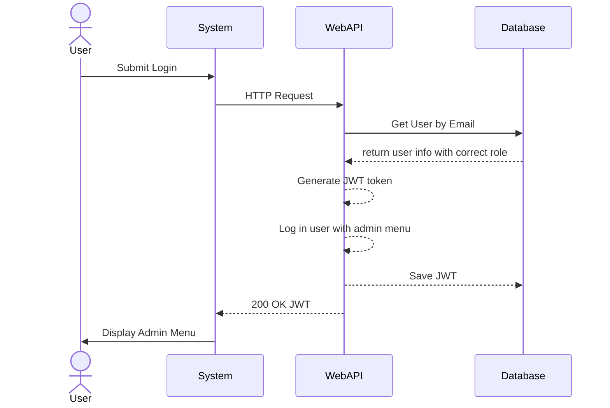
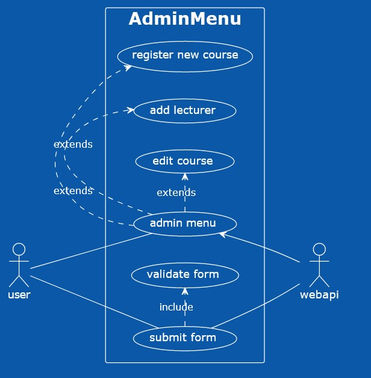
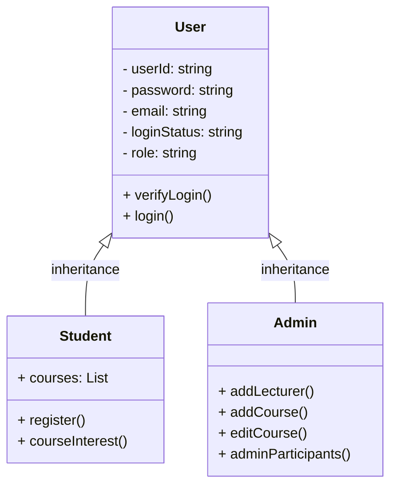

# Admin Sign In

## User story

**As an admin** on the site, **I want to** have an admin menu, **so that I can** access the functionality availabe admin users on the site

## Activity Diagram

```mermaid
flowchart TD
    Start((Start)) ==> LogIn(Log In)
    LogIn ==> If{User is admin}
    If --false--> UserMenu(User Menu)
    UserMenu --> End((X))
    If --true--> GenernateJWT(Generate JWT)
    GenernateJWT --> Sync(This is just a placeholder for simultanious action)
    Sync --> LogInAdmin(Log In Admin)
    Sync --> SendJWT(Send JWT)
    Sync --> StoreJWT(Store JWT)
    LogInAdmin --> SyncEnd(This is just a placeholder for simultanious action)
    SendJWT --> SyncEnd
    StoreJWT --> SyncEnd
    SyncEnd -->ADMIN
    subgraph ADMIN
    RegisterNewCourse(Register a new course)
    EditCourse(Edit a course)
    AddLecturer(Add a lecturer)
    end
    EditCourse --> EDIT
    subgraph EDIT
    AdminParticipants(Admin Course Participants)
    AddParticipants(Add new Participants)
    CourseMaterial(Edit and add course material)
    end
    EDIT -->EndProgram((End))
    RegisterNewCourse --> EndProgram
    AddLecturer --> EndProgram

    style Start stroke:none, fill:#000
    style End stroke:#fff, stroke-width:1px, fill:#000

    style Sync fill:#000,stroke:#000,stroke-width:2px,color:#000
    style SyncEnd fill:#000,stroke:#000,stroke-width:2px,color:#000
    style LogInAdmin stroke:none
    style SendJWT stroke:none
    style StoreJWT stroke:none

    style EditCourse stroke:#00ff00
    style RegisterNewCourse stroke:#00ff00
    style AddLecturer stroke:#00ff00    

    style AdminParticipants stroke:none
    style AddParticipants stroke:none
    style CourseMaterial stroke:none

    style EndProgram fill:#000,stroke:#fff,stroke-width:4px

```

## Sequence Diagram

## Use Case Diagram

<!--
@startuml
left to right direction
skinparam packageStyle rectangle
actor user
actor webapi

rectangle AdminMenu {
 (user) -- (admin menu)
 (admin menu) .> (register new course) : extends
 (admin menu) .> (add lecturer) : extends
 (admin menu) .> (edit course) : extends
 (user) -- (submit form)
 (submit form) .> (validate form) : include
 (submit form) -- (webapi)
 (admin menu) <-- (webapi)
}
@enduml
-->

## Class diagram

