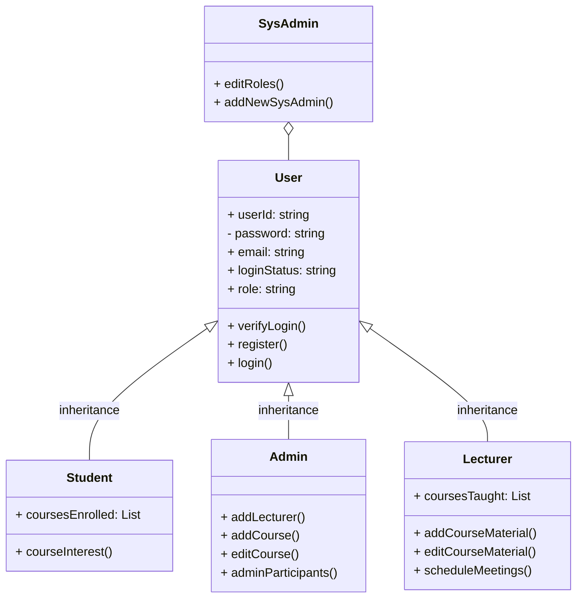

## Class diagram

```mermaid
classDiagram
class User{
    + userId: string
    - password: string
    + email: string
    + loginStatus: string
    + role: string
    + verifyLogin()
    + register()
    + login()
}

class Student {
    + coursesEnrolled: List
    + courseInterest()
}

class Lecturer {
    + coursesTaught: List
    + addCourseMaterial()
    + editCourseMaterial()
    + scheduleMeetings()
}

class Admin {
    + addLecturer()
    + addCourse()
    + editCourse()
    + adminParticipants()
}

class SysAdmin{
    + editRoles()
    + addNewSysAdmin()
}

SysAdmin o-- User
User <|-- Student : inheritance
User <|-- Admin : inheritance
User <|-- Lecturer : inheritance
```
