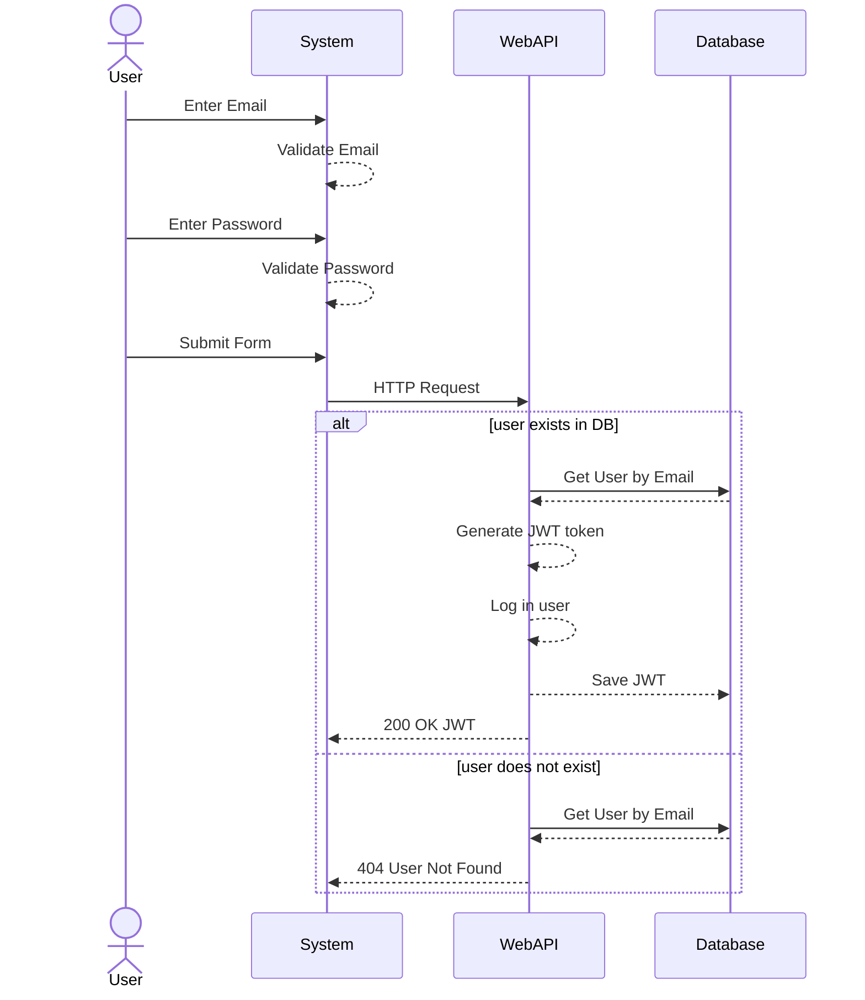
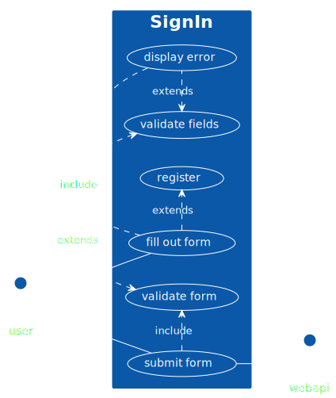

# Existing User Signup

## User story

**As an existing user** on the site, **I want to** be able to log into my account, **so that I can** access the content availabe to me according the my level of access.

## Activity Diagram

```mermaid
flowchart TD
    Start((Start)) ==> LogIn(Log In)
    LogIn ==> If{User has account}
    If --false--> SignUp(Sign Up)
    SignUp --> End((X))
    If --true--> LogInView(Log in View)
    LogInView --> Sync(This is just a placeholder for simultanious action)
    Sync --> Email(Fill in Email)
    Sync --> Password(Fill in Password)
    Email --> ValidateEmail(Validate Email)
    Password --> ValidatePassword(Validate Password)
    ValidateEmail -->SyncEnd(This is just a placeholder for simultanious action)
    ValidatePassword --> SyncEnd
    SyncEnd --> SubmitForm(Submit Form)
    SubmitForm -->EntriesValid{Input valid}
    EntriesValid --true--> UserExists{User Exists in DB}
    UserExists --false--> ErrorMessage(ErrorMessage)
    ErrorMessage --redirect user to --> SignUp
    EntriesValid --false --> Merge{ }
    Merge --> DisplayError(Display Error in Form)
    DisplayError --> LogInView
    UserExists --true--> ValidPassword{password is valid}
    ValidPassword --true--> GenernateJWT(Generate JWT)
    ValidPassword --false--> Merge
    GenernateJWT --> Sync2(This is just a placeholder for simultanious action)
    Sync2 --> LogInUser(LogInUser)
    Sync2 --> SendJWT(Send JWT)
    Sync2 --> StoreJWT(Store JWT)
    LogInUser --> SyncEnd2(This is just a placeholder for simultanious action)
    SendJWT --> SyncEnd2
    StoreJWT --> SyncEnd2
    SyncEnd2 --> EndProgram(( End ))

    style Start stroke:none, fill:#000
    style End stroke:#fff, stroke-width:1px, fill:#000

    style Email stroke:none
    style Password stroke:none
    style ValidateEmail stroke:none
    style ValidatePassword stroke:none
    style LogInUser stroke:none
    style SendJWT stroke:none
    style StoreJWT stroke:none

    style ErrorMessage stroke:#f44336
    style DisplayError stroke:#f44336

    style Sync fill:#000,stroke:#000,stroke-width:2px,color:#000
    style SyncEnd fill:#000,stroke:#000,stroke-width:2px,color:#000
    style Sync2 fill:#000,stroke:#000,stroke-width:2px,color:#000
    style SyncEnd2 fill:#000,stroke:#000,stroke-width:2px,color:#000
    style EndProgram fill:#000,stroke:#fff,stroke-width:4px
```

## Sequence Diagram

## Use Case Diagram
<!--
@startuml
left to right direction
skinparam packageStyle rectangle
actor user
actor webapi

rectangle SignIn {
 (user) -- (fill out form)
 (fill out form) .> (validate fields) : include
 (validate fields) <. (display error) : extends
 (fill out form) .> (register) : extends
 (user) -- (submit form)
 (submit form) .> (validate form) : include
 (validate form) <. (display error) : extends
 (submit form) -- (webapi)
}
@enduml
-->

